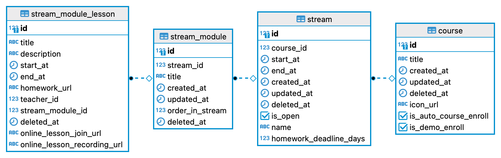
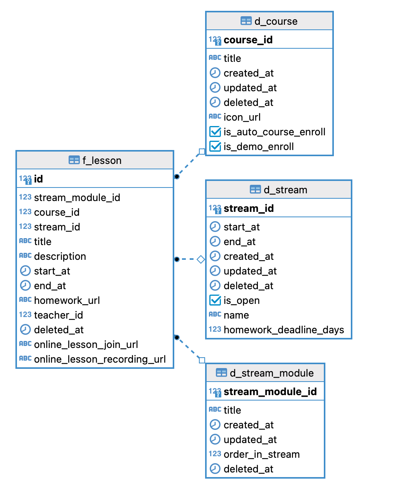
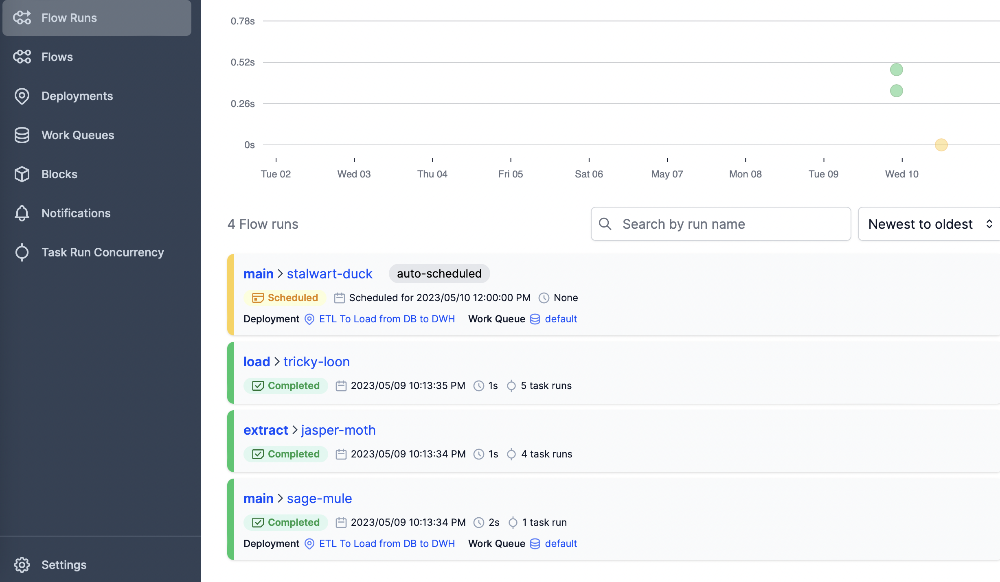

# Тестовое задание для SkyEng Data Engineer Role

## Запуск Проекта

Для запуска проекта необходимо склонировать репозиторий и из корневой папки запустить следующую команду:

```bash
  docker-compose up
```
После выполнения команды будут созданы обычная БД, DWH заполнены тестовые данные, запуститься ETL для изначальных данных и создатся расписание для запуска ETL на ежедневной основе для данных за "вчера".

Prefect UI будет доступен по ссылке:
http://127.0.0.1:4200
База данных доступна по порту 5433
DWH доступен по порту 5434

## Отчет по заданию

### 1. Проектирование модели и построение ER-Диаграммы :
Изначальная схема БД:



Для DWH я решил денормализовать БД по модели Star Schema.
Таблиц не так много, за основную таблицу фактов я взял сущность stream_module_lesson и добавил к ней информацию о потоках и курсе, в рамках которых проходят данные уроки. Таким образом в одной лишь таблице фактов у нас хранятся все данные, а в случае необходимости дополнительных данных из таблиц course, stream и stream_module понадобится только один join. 
Получилась следущая модель:


### 2. Построение ETL:

Для реализации ETL я решил для удобства создать view в БД источнике, на основе которой соберутся данные для целевой таблицы в DWH:
```SQL
drop view if exists etl_f_stream_module_lesson_view cascade;
create or replace view etl_f_stream_module_lesson_view as
select sml.id, 
	   sml.title, 
	   sml.description, 
	   sml.start_at, 
	   sml.end_at, 
	   sml.homework_url,
	   sml.teacher_id,
	   sml.stream_module_id,
	   sml.deleted_at,
	   sml.online_lesson_join_url,
	   sml.online_lesson_recording_url,
	   sm.stream_id,
	   s.course_id,
	   sm.updated_at::date as updated_at,
	   sm.created_at::date as created_at
	   from stream_module_lesson sml
	   join stream_module sm on sml.stream_module_id = sm.id 
	   join stream s on sm.stream_id = s.id;
```
Затем Prefect flow написанный на Python ([Здесь можно посмотреть код](app/main.py)) выгружает данные из таблиц course, stream, stream_module и view etl_f_stream_module_lesson_view и создает 4 ДатаФрейма. После этого происходит Transform часть и переименовываются некоторые поля.
```python
@task()
def extract_data_from_db(date: date, table_name: str, db_url: str) -> pd.DataFrame:
    sql_query = f"""
                select * from {table_name} where updated_at::date >= '{date}'::date and updated_at::date < now()::date
                """
    print(sql_query)
    with create_engine(db_url).begin() as engine:
        df = pd.read_sql(sql=sql_query, con=engine)
    return df
    

@flow(log_prints=True)
def extract(date: str, db_url: str = db_url) -> dict[str, pd.DataFrame]:
    print(f'Extracting data for the {date}')

    lessons_df = extract_data_from_db(
        date=date, table_name='etl_f_stream_module_lesson_view', db_url=db_url)
    print(f'Extracted lesson rows {len(lessons_df)}')

    course_df = extract_data_from_db(
        date=date, table_name='course', db_url=db_url)
    print(f'Extracted course rows {len(course_df)}')

    stream_df = extract_data_from_db(
        date=date, table_name='stream', db_url=db_url)
    print(f'Extracted stream rows {len(stream_df)}')

    stream_module_df = extract_data_from_db(
        date=date, table_name='stream_module', db_url=db_url)
    print(f'Extracted stream module rows {len(stream_module_df)}')

    return {'lesson': lessons_df,
            'course': course_df,
            'stream': stream_df,
            'stream_module': stream_module_df}

@task()
def transform(dataframes: dict):
    # just to make some transformation
    for entity, df in dataframes.items():
        index = f'{entity}_id'
        dataframes[entity] = df.rename(columns={'id': index}).set_index(index)
    dataframes['lesson']
    return dataframes
```


Далее выполняется Load часть:
В рамках процесса данные из всех датафреймов выгружаются в **Stage** таблицы (d_stream_module_stage, d_course_stage, d_stream_stage и f_lesson_stage).

```python
@task()
def load_to_dwh(df: pd.DataFrame, target_table: str, dwh_url: str) -> None:
    with create_engine(dwh_url).begin() as conn:
        df.to_sql(f"{target_table}", con=conn, if_exists="replace")

@flow(log_prints=True)
def load(dataframes: dict, dwh_url: str):
    for entity, df in dataframes.items():
        if entity == 'lesson':
            load_to_dwh(df=df, target_table='f_lesson_stage', dwh_url=dwh_url)
        else:
            load_to_dwh(df=df, target_table=f'd_{entity}_stage', dwh_url=dwh_url)
    upsert_from_stage(dwh_url)
```

После загрузки в промежуточные таблицы вызываются хранимые в Postgres функции, которые выполняют операцию UPSERT (Insert and Update) для всех новых данных. 

```python
@task(log_prints=True)
def upsert_from_stage(dwh_url: str):
    with create_engine(dwh_url).connect() as conn:
        results = conn.execute(text('select * from upsert_all()'))
        results = results.fetchone()
        print(f"d_course: {results[0]}, d_stream: {results[1]}, d_stream_module: {results[2]}, "
              f"f_lesson: {results[3]}")
        conn.execute(text("refresh materialized view lesson_stream_dm;"))
        conn.connection.commit()
```
Пример PostgreSQL функции для Upsert'a данных по курсам:

```SQL
CREATE OR REPLACE FUNCTION upsert_d_course() 
RETURNS table(row_cnt integer) as
$$
BEGIN
    INSERT INTO d_course (course_id, title, created_at, updated_at, deleted_at, icon_url, is_auto_course_enroll, is_demo_enroll)
        SELECT course_id, title, created_at, updated_at, cast(deleted_at as timestamp) as deleted_at, icon_url, is_auto_course_enroll, is_demo_enroll FROM d_course_stage
        ON CONFLICT (course_id) DO 
        UPDATE SET 
            title = EXCLUDED.title,
            created_at = EXCLUDED.created_at,
            updated_at = EXCLUDED.updated_at,
            deleted_at = cast(excluded.deleted_at as timestamp),
            icon_url = EXCLUDED.icon_url,
            is_auto_course_enroll = EXCLUDED.is_auto_course_enroll,
            is_demo_enroll = EXCLUDED.is_demo_enroll;
    get diagnostics row_cnt = ROW_COUNT;
    RETURN query select row_cnt;
END;
$$ LANGUAGE plpgsql;
```

Код всех процедур можно найти тут: [ссылка](https://github.com/eraline/skyeng_test/blob/c8abd5e63bc808acf476b5e785895829db241f7b/app/db/schemes.py#L174)

В конце выполнения ETL запускается refresh для витрины данных, о котором поговорим ниже.

Данный Flow (ETL) работает ежедневно по расписанию, запускается и логгируется с помощью утилиты Prefect, на скриншоте видно, что ETL успешно отработал и следующий в статусе "scheduled"


### 3. Витрина данных
Для витрины данных я создал материализованное представление, т.к. оно кэширует результат, а данные будут менятся лишь раз в день, поэтому по окончании выгрузки материализованное представление автоматически обновляется учитвая последние загруженные данные. Таким образом оно будет быстро работать, не нагружать систему и всегда иметь самые актуальные данные.
Код витрины данных:

```SQL
drop view if exists lesson_stream_dm;
create materialized view lesson_stream_dm
as
select 
	fls.id, 
	fls.title as lesson_title, 
	fls.teacher_id, 
	fls.stream_module_id, 
	fls.stream_id, ds."name", 
	ds.homework_deadline_days, 
	fls.course_id,
	dc.title as course_title,
	dc.is_demo_enroll
from 
f_lesson fl fl
join d_stream ds using (stream_id)
join d_course dc using (course_id);
```
